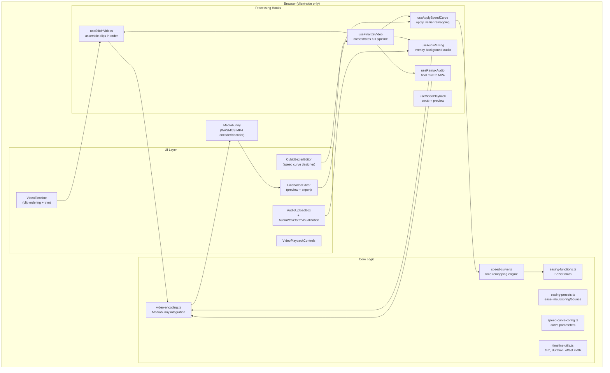
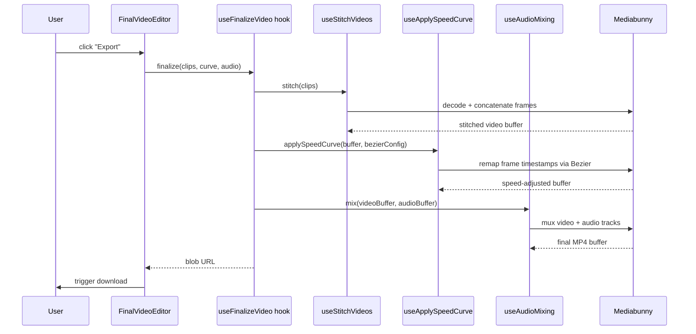

# easy-peasy-ease — Architecture

## Overview

A fully client-side Next.js video editor. All video processing — decoding, speed-curve application, stitching, and MP4 encoding — runs in the browser via Mediabunny (a WASM-based media library). No server-side processing, no uploads, no storage.

---

## System Diagram

---

## Processing Pipeline

---

## Speed Curve Engine

The core feature is applying a custom Bezier speed curve to video playback. The process:

1. User defines a cubic Bezier curve in `CubicBezierEditor` (four control points)
2. `speed-curve.ts` converts the Bezier into a time-remapping function: `f(normalizedTime) → speed`
3. `useApplySpeedCurve` uses Mediabunny to decode the video and re-encode each frame with the remapped timestamp
4. The result plays back at variable speed matching the curve shape

Built-in presets in `easing-presets.ts`: linear, ease-in, ease-out, ease-in-out, spring, bounce.

---

## Components

| Component | Purpose |
|-----------|---------|
| `VideoTimeline` | Drag-to-reorder clips, scrub to set in/out points |
| `CubicBezierEditor` | Interactive Bezier control point editor with live preview |
| `AudioUploadBox` | Drop zone for background audio files |
| `AudioWaveformVisualization` | Canvas-based waveform display |
| `FinalVideoEditor` | Preview player + export button |
| `VideoPlaybackControls` | Play/pause/scrub for preview |

---

## Tech Stack

| Layer | Technology |
|-------|-----------|
| Framework | Next.js 16 (App Router) |
| Language | TypeScript 5 |
| Video encoding | Mediabunny (client-side WASM) |
| Animation | Motion (Framer Motion) |
| UI primitives | Radix UI (dialog, radio, tabs) + shadcn/ui |
| Styling | Tailwind CSS 4 |
| Analytics | @vercel/analytics |
| Testing | Vitest |

---

## Key Design Decisions

**All in the browser.** Mediabunny encodes MP4 frames using WASM in the browser tab. There's no server-side FFmpeg, no upload endpoint, and no data retention. The tradeoff is encoding speed (slower than server-side) and compatibility (Chrome/Firefox only for full WASM support).

**Hooks as pipeline stages.** Each processing step (`stitch`, `applySpeedCurve`, `mixAudio`, `remuxAudio`) is a separate React hook. `useFinalizeVideo` orchestrates them in sequence. This makes it easy to debug or replace individual stages.

**Bezier as the UX.** Rather than a speed slider or discrete presets, the speed control is a cubic Bezier editor — the same mental model as CSS transitions and motion design tools. Users who know Bezier curves can dial in any shape; everyone else uses presets.

**Session-only data.** No localStorage, no IndexedDB, no account. All state lives in React and hooks. Closing the tab clears everything. This is intentional for a weekend project — zero privacy surface.
